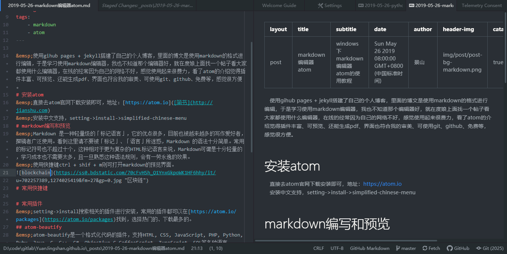

&emsp;使用gihub pages + jekyll搭建自己的个人博客，里面的博文是使用markdown的格式进行编辑，于是学习使用markdown编辑器，我也不知道那个编辑器好，就在度娘上面找一个帖子看大家都使用什么编辑器，在线的经常因为自己的网络不好，感觉使用起来很费力，看了atom的介绍觉得插件丰富、可预览、还能生成pdf、界面也符合我的审美、可使用git、github、免费等，感觉很方便。
# 安装atom
&emsp;直接去atom官网下载安装即可，地址：[https://atom.io]([简书](http://jianshu.com)  
&emsp;安装中文支持，setting->install->simplified-chinese-menu

# markdown编写和预览
&emsp;Markdown 是一种轻量级的「标记语言」，它的优点很多，目前也被越来越多的写作爱好者，撰稿者广泛使用。看到这里请不要被「标记」、「语言」所迷惑，Markdown 的语法十分简单。常用的标记符号也不超过十个，这种相对于更为复杂的HTML标记语言来说，Markdown可谓是十分轻量的，学习成本也不需要太多，且一旦熟悉这种语法规则，会有一劳永逸的效果。  
&emsp;使用快捷键ctrl + shif + m则可打开markdown的预览界面。

# 常用快捷键
&emsp;Atom设置选项 keybindings 中列举了相当长的一份关于快捷键的绑定列表，你也可以自定义快捷键的配置文件，有相同的快捷键则会覆盖掉原有的，使用你自己设定的。  
&emsp;下面是一些常用的快捷键：  
- Crtl+Shift+M&emsp;开启Markdown实时预览  
- Command+Shift+P&emsp;打开命令窗口，可以运行各种菜单功能  
- Command + T&emsp;快速多文件切换  
- Command + F&emsp;文件内查找和替换  
- Command + Shift + F&emsp;多文件查找和替换
- Command + [&emsp;对选中内容向左缩进
- Command + ]&emsp;对选中内容向右缩进
- Command + \ &emsp;显示或隐藏目录树
- Crtl + m&emsp;相应括号之间，html tag之间等跳转
- Crtl + Alt + B&emsp;格式化代码（需要安装atom-beautify）
- Crtl + ~ &emsp;调起CLI命令行界面（需要安装terminal-panel）

# 常用插件
&emsp;setting->install搜索相关的插件进行安装，常用的插件都可以在[https://atom.io/packages](https://atom.io/packages)找到，选择热门的、下载最多的。

## atom-beautify
&emsp;atom-beautify是一个格式化代码的插件，支持HTML, CSS, JavaScript, PHP, Python, Ruby, Java, C, C++, C#, Objective-C,CoffeeScript, TypeScript, SQL等多种语言。
- 安装后可以使用 Crtl + Alt + B 快捷键进行格式化。
- 也可以点击菜单Packages->Atom Beautify->Beautify进行格式化。

## markdown-pdf
&emsp;将markdown文件转为pdf文件。
- 使用convert命令。
- 点击菜单Packages->Markdown PDF->Covert。
